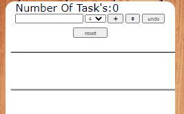

#  Pre Course Project - Todo List 📋

# this is my first final project of Scale-Up Velocity Course for web dev, so here are some of my skills at the beginning of the way.
  
## boilerplate: here is a link- https://omerokach.github.io/pre-course-2021-final-boilerplate/src/index
- A todo-list application for keeping your tasks not only in mind but also hard on the web, clean, organized and comfortable way.
   ## features: 
   - remove 
   - undo
   - priority 
   - reset.
   - checkbox

## bibliography

- W3school.com
- MDN
- GOOGLE of course
- Stack Overflow
- Resources of the pre course.

